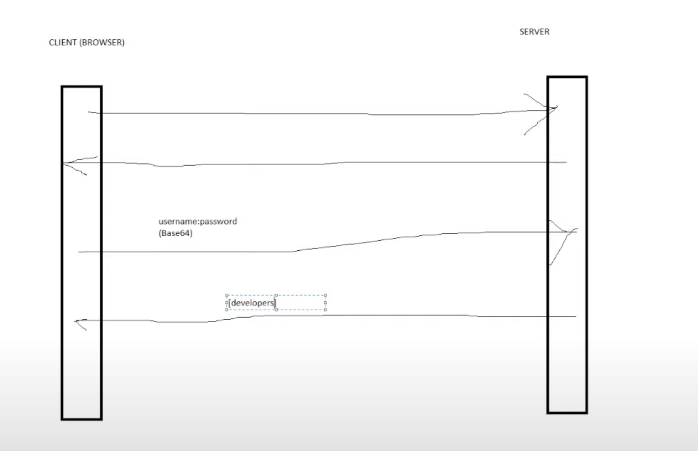

# SpringSecurityBasicAuthFormAuthJWT
В данном проекте я научусь работать со Spring Security. Научусь делать Basic Auth, Form Auth и авторизацию с помощью JWT

----

## Как устроен Basic Auth

Если мы попробуем получить данные в лоб, то мы получим ошибку с кодом 401, что означает не авторизован.

Поэтому что бы сервер предоставил нам данные, нам необходимо закодированные в Base64 логин и пароль передать серверу 
в хедере Authorization (браузер это делает сам, если у нас кастомная форма авторизации я хз нужно это делать или нет).
И когда сервер проверит, что мы можем получить доступ к ресурсу он нам его отдаст.

Чтобы сервер мог знать у каких пользователей есть доступ к системе, мы должны создать хранилище пользователей. Такое хранилище может
быть как защито внутрь кода, то есть пользователи будут храниться в памяти приложения (In Memory), так находиться за его предалами,
например в базе данных.